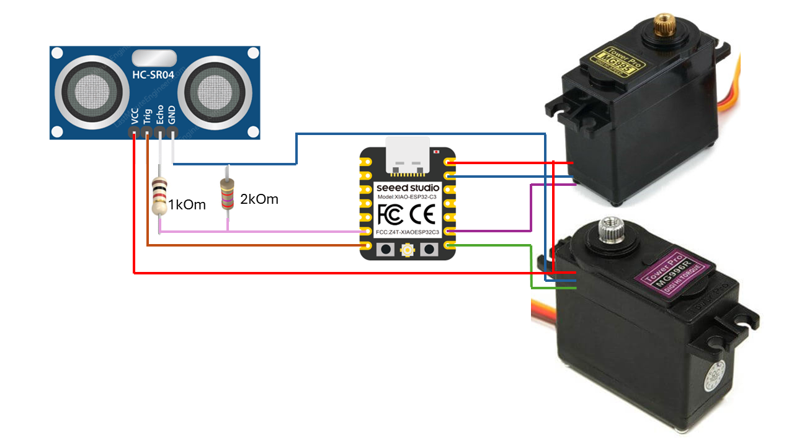

# Boogieman Dropper



Board: ESP32 (XIAO ESP32-C3 example) or ESP32 Dev Module


```
Notes:
- Servos get PWM pulses from the two servo pins. Provide separate servo power supply if using larger servos; common ground required.
- HC-SR04 VCC should be 5V on some modules; the project uses 3.3V tolerant pins — verify your sensor and level shifting as needed.
```


## Overview

Boogieman Dropper is a small ESP32-based project that monitors distance using an ultrasonic sensor and controls two servos to perform a "dropper" action. It is controllable via MQTT and includes a small web server for local control (MDNS name `dropper.local`).

Key features:
- WiFi + MQTT control (PubSubClient)
- Automatic/manual modes
- Ultrasonic sensor with simple smoothing
- Servo control with configurable wind-up time
- REST-like web UI served from the device (via onboard web server)
- MQTT topics for status, commands, and replies


## Hardware

Default pin mapping is in `include/board_config.h`. The example configuration included in the repo uses pins suitable for the XIAO ESP32-C3; change these defines for other boards.

Important pins (names in code):
- BOARD_TRIG_PIN — HC-SR04 TRIG
- BOARD_ECHO_PIN — HC-SR04 ECHO
- BOARD_SERVO1_PIN — Servo 1 PWM (dropper)
- BOARD_SERVO2_PIN — Servo 2 PWM (optional / counterweight)

Power: Provide a stable 5V or 6V supply for servos when using larger metal servos. Connect grounds together (ESP32 GND and servo power GND).


## Reference files

- `Schematic.png` — quick visual wiring guide used throughout the README.
- `pinout.pptx` — editable pinout diagram that can be updated for custom builds.


## MQTT topics and commands

Topics (defaults in `src/MQTT_config.h`):
- Command topic (base): `koprov/boogieman/dropper/CMD`
- Status topics (retained):
  - `koprov/boogieman/dropper/status/state` — online/offline/other
  - `koprov/boogieman/dropper/status/mode` — auto/manual
  - `koprov/boogieman/dropper/status/distance` — latest distance (cm)
  - `koprov/boogieman/dropper/status/dist_threshold` — current detection threshold
  - `koprov/boogieman/dropper/status/windTime` — configured wind-up seconds
  - `koprov/boogieman/dropper/status/reply` — JSON acknowledgements for commands (not retained)
  - `koprov/boogieman/dropper/status/result` — JSON results for commands

Supported compact command formats (publish to command topic):
- Single-word commands:
  - `drop` — perform the drop
  - `up` — lift
  - `windUp` — wind up for configured seconds
  - `reset` — perform a reset routine
  - `sleep` / `wakeUp` — put servos to sleep or wake them
  - `reboot` — reboot MCU

- Key=value commands:
  - `threshold=<cm>` — set detection distance threshold (5..400)
  - `windTime=<seconds>` — set wind-up seconds (0.01..60)
  - `mode=auto|manual` — set operation mode
  - `servo1=<microseconds>` — directly set servo1 microseconds
  - `servo2=<microseconds>` — directly set servo2 microseconds

- Optional `id=<request-id>` can be appended (or provided as a separate token) to correlate replies. Tokens may be separated by `;` or `,`.

Examples:
- `drop;id=1234`
- `threshold=30;id=cfg1`

Reply examples (JSON) will be published to `koprov/boogieman/dropper/status/reply` and include `status` and `msg` fields and a `ts` timestamp.


## Configuration

WiFi and MQTT defaults are defined in `src/MQTT_config.h` as `inline` variables:
```cpp
inline const char* wifi_ssid = "SSID";
inline const char* wifi_password = "password";
inline const char* mqtt_broker = "192.168.0.0";
```

Options to customize:
- Edit `src/MQTT_config.h` and replace the `SSID`, `password`, and broker address with your values.
- Better: create a `secrets.h` (not committed) and include or `#define` the values there, or set build-time flags in `platformio.ini`.

Security note: Do not commit real WiFi credentials to version control. Use a `secrets.h` or PlatformIO build flags.


## Build & Flash (PlatformIO)

This project uses PlatformIO. Two example environments are provided in `platformio.ini`:
- `esp32dev` — generic ESP32 dev board
- `xiao_esp32c3` — Seeed XIAO ESP32-C3

Build for the XIAO ESP32-C3 environment and upload:

```powershell
# Build
pio run -e xiao_esp32c3

# Upload
pio run -e xiao_esp32c3 -t upload

# Monitor serial output
pio device monitor -e xiao_esp32c3
```

(If you use the `esp32dev` env, replace the environment name accordingly.)


## Web UI

A lightweight web server is started on the device. If mDNS is available on your network, you can open:

http://dropper.local

This UI allows toggling auto/manual mode and invoking actions locally.


## Development notes

- Main entry: `src/main.cpp`
- MQTT handling: `src/MQTT_config.cpp` / `.h`
- Servo routines: `src/servo_control.cpp` / `.h`
- Ultrasonic sensor code: `src/ultrasonic_sensor.cpp` / `.h`
- Simple web server: `src/server.cpp` / `.h`


## Troubleshooting

- If WiFi fails to connect, check `wifi_ssid`/`wifi_password` in `src/MQTT_config.h`. The code restarts the MCU if WiFi connection does not complete within 10s.
- If servos twitch or behave oddly, confirm power supply and grounds.
- If MQTT won't connect, confirm `mqtt_broker` is reachable from the device and the broker accepts connections from the LAN.


## Contribution

Contributions welcome. Please open issues or pull requests. For sensitive data (secrets), do not include them in PRs; use `secrets.example.h` in PRs if you add a secrets helper.


## License

This project is provided as-is. Add a LICENSE file as needed.
